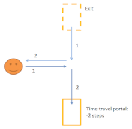

# timetravel

This application will generate and display all the possible trajectories in a universe, in presence of time travel.

Introduction
============

In the following picture, there is a character traveling toward the right in a straight line (like a billiard ball).
If the character encounters another character, he will always turn right (as a rule).
There is also a time portal at the bottom, that will teleport you to the exit portal, 2 steps back in the past.



In this scenario, there are 2 possible trajectories for the character:

- He just goes straight and passes between the two portals. No problem.
- At the start of the simulation, another character appears in the exit portal: it's you from the future! Both goes straight one step, meeting in the middle. Then, as per the rule on collisions, both turn right. The initial character enters the portal at step 2, thus closing the loop. The second character continues toward the left.

See this [series of blog posts](https://www.corentindupont.info/blog/posts/Cosmology/2022-04-04-TimeTravel2.html) for more explainations.

Install
=======

run:
```
cabal install
```
Launch:
```
timetravel
```

**Warning**
This is a warning
