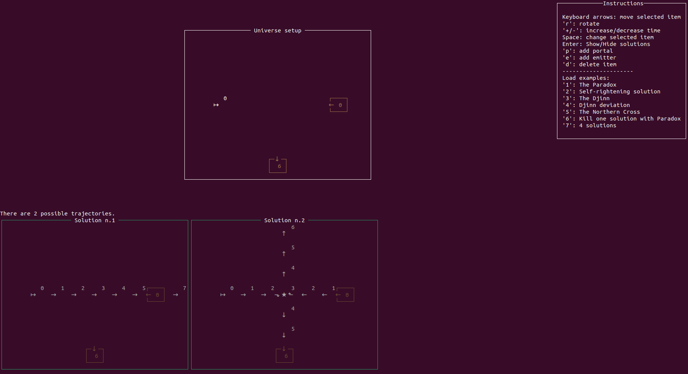
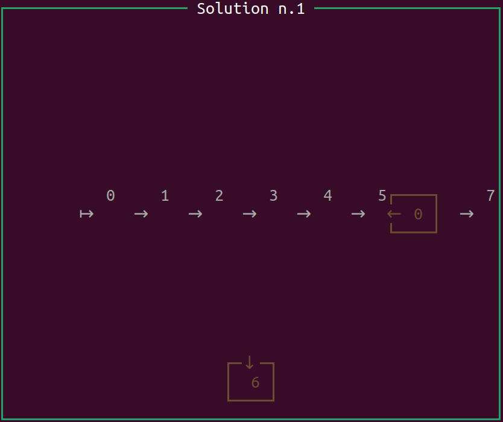

# Timetravel

This is a demonstrator for studying time travel in a simple setting.
The application will generate and display all the possible trajectories in a universe, in presence of time travel.
See this [series of blog posts](https://www.corentindupont.info/blog/posts/Cosmology/2022-04-04-TimeTravel2.html) for more explainations.

Install
=======

run:
```
cabal install
```
Launch:
```
timetravel
```

How to play
===========

You start by setting up the universe, and them running the simulation.
In the picture bellow, there is an "emitter" on the left and two time portals: an entry portal, and an exit portal.    
The emitter will emit a "walker", here at time step 0.
The walkers always walk straight, except when they collides with another walker. 
When a walker collide with another walker, they always turn right (as a rule).
If the walker enters the entry portal at the right time, it will walk out the of the exit portal at the mentioned time.
   


You can move the various elements of the universe, such as emitter and portals, and add more of them (see the instructions).   
**When you are ready, hit Enter.**



In this universe setup, there are 2 possible trajectories for the character:   
The first solution is simple: he just goes straight. At step 6, he will walk over the exit portal (this has no effects).



However, there is another solution!   
At the start of the simulation, another walker appears in the exit portal: it's you from the future! Both goes straight some steps, meeting in the middle. Then, as per the rule on collisions, both turn right. The initial walker enters the portal at step 6, thus closing the loop. The second walker continues toward the top.


